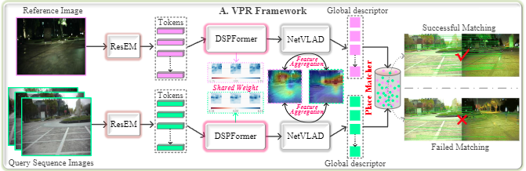

# Dark Enhanced Visual Place Recognition

This repository implements a dark-enhanced network for robust visual place recognition in low-light conditions. The project is based on the research paper which introduces ResEM (Residual Enhancement Module) and DSPFormer (Dual-Level Sampling Pyramid Transformer) to enhance image quality and extract discriminative features in challenging environments.



Datasets will be released later.
## Table of Contents

- [Introduction](#introduction)
- [Installation](#installation)
- [Usage](#usage)
- [Training](#training)
- [Evaluation](#evaluation)

## Introduction

Visual Place Recognition (VPR) is crucial for mobile robots and autonomous systems, particularly in low-light environments where standard methods struggle. This repository implements the following:

- **ResEM (Residual Enhancement Module):** A lightweight GAN-based module that enhances image quality under low-light conditions.
- **DSPFormer (Dual-Level Sampling Pyramid Transformer):** A transformer-based network that extracts robust features for place recognition.

The network is trained using a combination of Triplet Loss and Adversarial Loss to improve performance under challenging conditions.

## Installation

To set up the project, follow these steps:

1. Clone the repository:
    ```bash
    git clone https://github.com/CV4RA/Dark-enhanced-VPR-Net.git
    cd Dark-enhanced-VPR-Net/
    ```

2. Set up a virtual environment:
    ```bash
    python3 -m venv vpr_env
    source vpr_env/bin/activate  # For Linux/MacOS
    # vpr_env\Scripts\activate  # For Windows
    ```

3. Install the dependencies:
    ```bash
    pip install -r requirements.txt
    ```

## Usage

### Project Structure

- `models/`: Contains the implementation of ResEM, DSPFormer, and the loss functions.
- `data/`: Data loading scripts for training and evaluation.
- `train/`: Training scripts.
- `eval/`: Evaluation scripts.
- `requirements.txt`: Python dependencies.

### Training

To train the model, run the following command:

```bash
python train_dark_vpr.py
 ```
### Evaluation

To evaluate the model, run the following command:
```bash
python eval_dark_vpr.py
 ```
